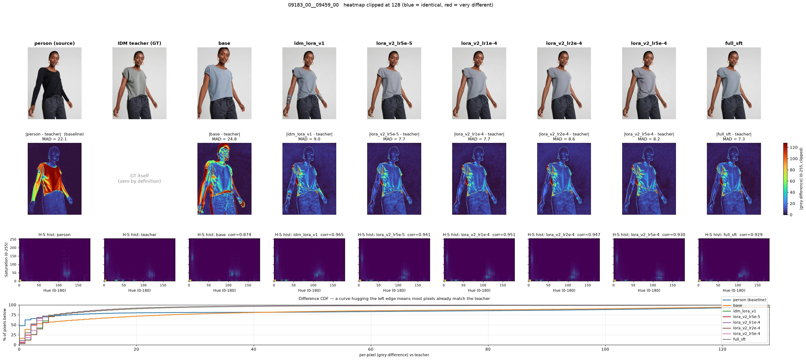

# 评测

两条轨道，每次模型变更都跑同一套（详见 [EVAL_RESULTS_20260815.md](EVAL_RESULTS_20260815.md) 的实测结果）：

| 轨道 | 脚本 | 素材 | 回答什么 | 有无 GT |
|---|---|---|---|---|
| 域内留出 | `scripts/eval_viton_holdout.py` | VITON-HD **test**（训练未见） | 有没有学到换装能力 | 有（IDM teacher） |
| 目标域 | `scripts/run_case02_v2_prompt_eval.sh` | case02 业务帧 + GPT 参照 | 真实关键帧上能不能用 | 无 |

## 入口

- 域内留出集：`scripts/eval_viton_holdout.py`
- 业务域（全文 v2）：`scripts/run_case02_v2_prompt_eval.sh`
- 短指令对照：`scripts/run_case02_idm_vs_base.sh`
- 核心推理逻辑：`scripts/zero_shot_compare.py`
- 拼图：`scripts/compose_idm_compare.py`（`--idm-label` 指定第二个模型的栏位名）
- **指标可视化**：`scripts/visualize_metrics.py`
- 截断探测：`scripts/probe_editplus_truncation.py`

## Prompt 模式

| `--prompt-mode` | 说明 |
|---|---|
| `v2` | 全文 garment-only 模板（主评测） |
| `short` | 短换衣指令 |
| `production` | outfit_spec 内存贮 prompt（可能过时） |

---

## 指标定义

两个标量都在 `zero_shot_compare.mad_and_hist()` 里计算，可视化脚本复用同一套算法。

### MAD（Mean Absolute Difference）

两张图各自转灰度，逐像素求亮度差的绝对值再取平均，尺度 **0–255**：

```
MAD(a, b) = mean(|grey(a) - grey(b)|)
```

0 = 完全相同，越大 = 差异越大。尺寸不同的话，`b` 先缩放到 `a` 的尺寸。

**只看亮度，不看颜色。** 一件深蓝衣服换成同等明度的深红，MAD 几乎不动——所以必须配合下面的直方图指标。

### hist corr（Hue-Saturation 直方图相关）

转到 HSV，取色调 H 与饱和度 S 两个通道做 32×32 的二维直方图，L2 归一化后算相关系数（`cv2.HISTCMP_CORREL`），范围 **−1 ~ 1**：

```
corr = compareHist(hist_HS(a), hist_HS(b), HISTCMP_CORREL)
```

1 = 两图用的**颜色种类与比例**完全一致。它**不管颜色出现在什么位置**，只看色彩构成，正好补上 MAD 的盲区。

---

## 怎么读这些数字

域内留出集里有三个对象：**person**（源人物图）、**teacher**（IDM-VTON 输出，即 GT）、**模型输出**。
于是有两列 MAD，回答两个不同问题：

| 列 | 问题 |
|---|---|
| `MAD vs person` | 模型**改了多少**（改动量） |
| `MAD vs teacher` | 模型**离目标多远**（正确性） |

**单看任一列都会被骗**：第一列低可能是「压根没改」；第二列虽然越低越好，但缺少「多低才算低」的尺度。

### 关键：用 `MAD(person, teacher)` 当基线

`eval_viton_holdout.py` 会输出这个值（2026-08-15 那批 6 样本上是 **18.64**）。
它是原图与 GT 之间的固有距离，即**一次正确换装必然产生的改动量**，同时给两列提供刻度：

- 第一列的**理想值 ≈ 基线**：明显更大 = 乱改，明显更小 = 没改够
- 第二列的**及格线 = 基线**：因为模型只要原样输出源图，就能拿到这个分。
  **得分高于基线，等于比交白卷还差。**

实测示例：

| 模型 | MAD vs person | MAD vs teacher | 判读 |
|---|---|---|---|
| *基线 teacher vs person* | *18.64* | *0* | 刻度 |
| base | 35.65 | 28.94 | 改动量约 2 倍且比交白卷更远 → 大改且改错 |
| full_sft | 20.04 | 9.31 | 改动量对，且明显优于交白卷 → 改得又对又适量 |

### 没有 GT 时（业务域）怎么办

case02 没有正确答案图，只能测「MAD vs 源帧」。此时用 **GPT Image 2 当刻度**——它是人工确认做对了的，
它的改动量近似「本该改多少」。

但要小心：**比 GPT 低不等于更好**，也可能是该改的没改（实测 full_sft 丢失字幕就会压低这个数）。
所以这一列只能证明「改动量是否回到合理量级」，质量判断必须看图。

---

## 可视化

标量看不出**差异分布在哪**——「重绘整幕」和「精确换装」可能给出相近的 MAD。用：

```bash
python scripts/visualize_metrics.py --eval-dir $OUTPUT_ROOT/viton_holdout_eval
```

输出一张「列=对象、行=视角」的图：

| 行 | 内容 |
|---|---|
| 1 | 原图：person / teacher / 各模型 |
| 2 | `\|x − teacher\|` 差分热力图（TURBO，固定裁剪在 128，蓝=相同 红=差异大） |
| 3 | H-S 二维直方图（真实 H/S 坐标轴，开方显示避免小值不可见） |
| 4 | 每像素差异的 CDF |

**第 2 行第 1 格是钥匙**：它画的是 `|person − teacher|`，也就是基线的可视化——
**一次正确换装该动哪些像素**。实测中它只在上衣区域发红，裤子/背景/脸保持深蓝。
拿右边各模型的热力图与它对照，一眼就能区分「局部编辑」与「整幕重绘」：
base 的热力图连人脸都在发亮（身份被改），full_sft 则大面积深蓝。

**第 4 行 CDF** 是纯增量信息：横轴是每像素差异、纵轴是「差异小于该值的像素占比」，
曲线越靠左上越好。它能拆开被均值掩盖的两种情况——「少数像素差很多」与「所有像素差一点」。
实测中 base 的曲线**全程位于 person 基线之下**，说明它不只是平均分差，而是在每一个差异档位上都比原封不动更糟。

固定裁剪 128 是为了让不同面板、不同样本、不同轮次之间可以横向比较，不要改成自适应。

实例（七方对照，`base` 的差分几乎铺满全图并波及人脸，训练后的各变体大面积深蓝）：



---

## 指标的边界（不要过度解读）

1. **不理解语义。** 能区分量级差异（重绘 vs 局部编辑），分不出领型、袖长、Logo 是否精确——这些只能看图。
2. **天花板是 teacher。** 衡量的是「像不像 IDM-VTON」，teacher 自身的瑕疵会被当成正确答案。
3. **样本量小。** 默认 6 张只够看趋势；下结论前看方向是否一致（实测 6/6 同向且方差收紧）。
4. **对全局平移/亮度偏移敏感。** 整体偏亮会抬高 MAD，即便结构完全正确。

## 建议关注点

1. 长指令下是否整幕重画
2. 朝向 / 背景 / 身份是否与源帧一致
3. 颜色是否跟随主商品图（配合 hist corr 与直方图面板）
4. 字幕 / 花字是否正确处理（当前已知短板）
5. 短指令回归是否明显退化

原理说明见 [KNOWLEDGE.md](KNOWLEDGE.md)。
