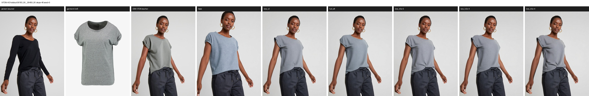

# 全参 SFT 评测结果（2026-08-15）

模型：[lee31221/Qwen-Image-Edit-Outfit-2511-SFT](https://huggingface.co/lee31221/Qwen-Image-Edit-Outfit-2511-SFT)
（训练记录见 [FULL_SFT_RUN_20260815.md](FULL_SFT_RUN_20260815.md)）

双轨评测，固定 `seed=0 / steps=40`：域内留出集看「有没有学到换装」，业务域看「能不能用」。

---

## 1. 域内：VITON-HD test 留出集（训练未见）

脚本 `scripts/eval_viton_holdout.py`，6 样本，768×1024，prompt 1592 字符（与训练同分布）。

| 模型 | 可训参数 | MAD vs 人物图 | MAD vs teacher | hist corr vs teacher | 单样本 stdev |
|---|---|---|---|---|---|
| *参照：teacher vs 人物图* | — | *18.64* | *0* | *1.0* | — |
| base | 0 | 35.66 | 28.95 | 0.8717 | 10.90 |
| lora r16 @ 1e-4 | 0.118B | 19.63 | **9.23** | 0.9273 | 1.29 |
| **full_sft** | **20.43B** | 20.04 | 9.32 | **0.9433** | 1.52 |
| lora r16 @ 5e-5 | 0.118B | 20.00 | 9.92 | 0.9350 | 1.87 |
| lora r16 @ 2e-4 | 0.118B | 20.58 | 10.02 | 0.9464 | 1.33 |
| lora r16 @ 5e-4 | 0.118B | **19.20** | **8.94** | 0.9452 | **0.65** |

> 指标一律从**落盘 JPEG** 计算。早期版本对新生成图用内存 PIL、对复用图用 JPEG，
> 而 JPEG 的 4:2:0 色度下采样只损伤色度、几乎不动亮度，导致 `hist corr` 两组不可比
> （灰度 MAD 仅差 0.01）。现已统一，故本表 hist 数值与首版略有出入。

**怎么读这三行（关键）：**

`MAD(person, teacher) = 18.64` 是「一次正确换装本该产生的改动量」，作为标尺：

- **full_sft 改动量 20.04 ≈ 标尺 18.64** → 改得不多不少
- **full_sft 距 teacher 9.31 < 18.64** → 比原图更接近 teacher，**说明不是靠「少改动」刷低指标**
- **base 改动量 35.65 ≈ 标尺的 2 倍**（改太多），且**距 teacher 28.94 > 18.64** → 比什么都不做还远，即在改错的东西

6/6 样本的 `MAD vs teacher` 全部改善，且方差收紧（base 17.1–47.4，full_sft 7.3–11.9）。

**视觉确认：** base 会拉近镜头、改构图、人脸漂移、颜色偏；训练后的各变体都保住取景/姿态/身份，
服装款式跟随参考图（船领、七分袖等细节能对上），且**彼此肉眼难分**——与指标一致。

另一个常被忽略的信号是**单样本 stdev**：base 高达 10.90（时好时坏、极不稳定），
训练后全部收敛到 0.65–1.87。训练带来的一致性提升甚至比均值提升更明显。

### 1.1 LoRA 与全参是否有差别（配对检验）

六个模型跑的是**同一批样本**，所以应当用配对比较——按样本作差再看均值与标准误，
而不是比较两个独立均值（后者会把样本难度差异当成噪声，在 n=6 时几乎必然得不出结论）。

`scripts/paired_eval_stats.py`，指标 `mad_vs_teacher`，参照 `full_sft`（负 = 更接近 teacher）：

| 对照 | Δ | sd | se | t | 判定（df=5，\|t\|>2.57 即 p<0.05） |
|---|---|---|---|---|---|
| lora @ 1e-4 | **−0.09** | 0.46 | 0.19 | −0.48 | **与全参无法区分** |
| lora @ 5e-5 | +0.61 | 0.40 | 0.16 | +3.69 | 显著劣于全参 |
| lora @ 2e-4 | +0.70 | 0.41 | 0.17 | +4.13 | 显著劣于全参 |
| lora @ 5e-4 | −0.38 | 1.58 | 0.64 | −0.59 | 无法区分（但样本间波动大） |

**结论：在这条域内留出集上，r16 LoRA（0.118B 可训、1h49m）与全参 SFT（20.43B、2h22m）
打平。** 全参多训的 173 倍参数没有换来可测量的优势。

这不代表全参没用，而是说明**当前瓶颈在数据而非容量**：训练集只有 1 条 prompt、
仅正面上装、每人 1 件衣服（见 [DATA_SCALING_PLAN.md](DATA_SCALING_PLAN.md)），
这个难度用低秩增量就足以拟合。要检验容量差异，得先把数据的多样性提上去。

工程含义很直接：同等效果下 LoRA 省 23% 时间、省掉 ZeRO-3 的复杂度，
产物是 226MB 适配器而非 40.86GB 全量权重。

拼图（`人物 | 服装 | IDM teacher | base | 各训练变体`）：




全部 6 组见 `outputs/viton_holdout_0815/*_compare.jpg`（`outputs/` 不入 git）。
VITON-HD 素材为 CC BY-NC，此处仅作研究用途展示，见 [NOTICE.md](../NOTICE.md)。

### 指标可视化

标量看不出差异**分布在哪**，用 `scripts/visualize_metrics.py` 展开：


三点值得注意：

1. 第 2 行第 1 格 `|person − teacher|` 是 18.64 基线的可视化——正确换装只该点亮上衣区域
2. `base` 的热力图连**人脸都在发亮**（身份被改），`full_sft` 大面积深蓝
3. 最下方 CDF 里 `base` 曲线**全程在 person 基线之下**：不只是均值差，而是在每个差异档位上都比原封不动更糟

指标定义、读法与陷阱见 [EVAL.md](EVAL.md#指标定义)。

---

## 1.2 LoRA 学习率扫描（单独对比）

四个 LR 点，其余全部对齐（同 11 415 条 v2 数据、r16、1 427 步、有效 batch 8、ConstantLR、bf16）。

| LR | MAD vs teacher | 单样本 stdev | 配对 vs full_sft | 训练 loss 窗口均值变化 |
|---|---|---|---|---|
| 5e-5 | 9.92 | 1.87 | 显著劣（t=+3.69） | −18.2%（降幅最大、最平稳） |
| **1e-4** | **9.23** | 1.29 | 无法区分 | −1.9% |
| 2e-4 | 10.02 | 1.33 | 显著劣（t=+4.13） | **+5.5%（不降反升）** |
| **5e-4** | **8.94** | **0.65** | 无法区分 | −15.4%（但噪声最大，max 0.217） |

### 关键发现：训练 loss 没能预测评测排名

上游的扫描报告依据 train loss 得出「5e-5 最干净、1e-4–5e-5 是稳定带、更高会失稳」。
**评测结果与之相左**：

- **5e-5 的 loss 降幅最大（−18.2%），评测却显著劣于全参**
- **5e-4 的 loss 曲线最不稳（尖峰到 0.217），评测反而最好**（均值 8.94、stdev 0.65 都是最低）
- 评测上的响应同样**非单调**：5e-4 好、1e-4 好、5e-5 与 2e-4 差，中间凹陷

这正是 [FULL_SFT_RUN](FULL_SFT_RUN_20260815.md) 第 7 节那个警告的实证：
扩散训练每步随机 timestep 与噪声，**train loss 是噪声主导的量**，
不同 LR 之间比较它的绝对值或降幅都没有意义。**选 LR 必须看留出集评测。**

### 需要注意的边界

- n=6，`5e-4` 虽然均值最好，但它与 full_sft 的配对差异 sd 高达 1.58（其余约 0.4），
  说明它在不同样本上表现摇摆——单个样本 `03922` 上它 8.72、full_sft 11.90，差距主要来自这一条。
  **不能据此宣称 5e-4 最优**，只能说它与全参无法区分。
- 全部结论都基于 VITON 域内、单一 prompt。业务域的排名可能完全不同，见下一节。

> 上游 `lora_lr_sweep/README.md` 的 Δ 列（−89.9% / +147.8% / +76.3% / −6.9%）与
> 同页 first100/last100 数值对不上（按那两列算应为 −1.9% / +5.5% / −15.4% / −18.2%），
> 正文引用的反而是后者。本表采用与 first100/last100 自洽的算法。

---

## 2. 业务域：case02 真实关键帧 + GPT Image 2 参照

脚本 `scripts/run_case02_v2_prompt_eval.sh`，2 shot，720×1280，live v2 prompt（**2000 / 1922 字符**）。

| 模型 | MAD vs 源帧 shot00 | shot01 |
|---|---|---|
| GPT Image 2（生产参照） | 48.04 | 37.28 |
| Qwen base | 72.77 | 86.77 |
| IDM-LoRA <sup>†</sup> | 42.13 | 81.94 |
| **full_sft** | **32.16** | **26.22** |

<sup>†</sup> **这一行不能用来比较 LoRA 与全参**，见下方「对比的有效边界」。

**定性差异（这里才是重点）：**

| 模型 | 表现 |
|---|---|
| GPT Image 2 | 只换服装，构图/姿态/背景/字幕全保留 —— 生产可用 |
| Qwen base | **整图重绘**：换成夜市/商场场景、换人，完全没在做局部编辑 |
| IDM-LoRA | 同样崩：shot00 变成拼贴（衣服悬浮、人头畸变），shot01 整场替换 |
| **full_sft** | **真正在做局部编辑**：走廊背景、姿态、鞋袜都保住，服装换成套装 |

full_sft 相对 base/LoRA 是**质变**（从「重绘整图」到「局部换装」），但**仍不及 GPT**，
可见缺陷：

1. **服装颜色错**：参考图是黑色/蓝色套装，输出成白色上衣
2. **字幕处理不过关**：shot00 直接丢掉底部字幕，shot01 重绘成乱码字形
3. 轻微身份漂移与背景简化

拼图：`outputs/case02_fullsft_0815/*_compare.jpg`

> **不入库**：case02 素材是业务视频帧且含真人肖像，故不随仓库分发，仅本地留档。

> 归档提示：`compose_idm_compare.py` 原先把第 4 栏标签写死为 `IDM-LoRA`，
> 现已改为 `--idm-label`（wrapper 用 `MODEL_B_LABEL` 传入），旧图注意标签可能不符。

---

## 3. 对比的有效边界（重要）

**`full_sft` vs `base` 是干净的对比**：同一份评测素材、同一条 prompt、同 seed 同步数，
base 未经任何训练。结论「全参 SFT 在域内和业务域都优于底座」成立。

**`full_sft` vs `IDM-LoRA` 是混淆的对比，不能得出「全参优于 LoRA」。** 两者训练时至少有三处不同：

| | IDM-LoRA | full_sft |
|---|---|---|
| metadata | `converted_idm_synth_train/`（v1） | `converted_idm_synth_train_v2/` |
| **prompt 长度** | **76–223 字符** | **1592 字符** |
| **prompt 种类** | **2 条英文短指令** | 1 条中文全文模板 |
| 学习率 | 1e-4 | 1e-5 |
| 可训参数 | DiT LoRA r16（约 0.118B） | 全部 DiT（20.43B） |
| 训练图片 | 11415（同一批） | 11415（同一批） |

图片是同一批，但**指令分布完全不同**。而评测统一用 live v2 prompt（留出集 1592 字符、
case02 2000/1922 字符），也就是说：

- `full_sft` 的评测指令**落在其训练分布内**
- `IDM-LoRA` 的评测指令**远在其训练分布之外**（训练见的是 76–223 字符英文短句）

所以 LoRA 的崩溃主要说明**指令分布不匹配**的破坏力，这本来也正是它被用来论证的观点
（见 [KNOWLEDGE.md](KNOWLEDGE.md)）。同一个数据点不能既用来证明「prompt 不匹配会崩」，
又用来证明「LoRA 容量不如全参」。

**该对照已于 2026-08-16 补齐**（见第 1.1 节）：用同一份 v2 数据、同为 1427 步重训了
r16 LoRA，结论是**与全参在域内留出集上无法区分**。因此本节的警告只适用于
本页第 2 节 case02 表里那一行旧的 `IDM-LoRA`（v1 短指令训练），
以及任何引用它来比较训练方式的说法。

**业务域的对照仍缺失**：case02 表里还没有 v2 LoRA 这一列，所以「在真实关键帧上
LoRA 与全参谁更好」目前无法回答。

## 4. 结论

**学会了任务，但被训练分布锁死；而且这个任务用不满全参的容量。** 三条结果放在一起：

- **域内**：训练后的模型全部远优于 base（MAD vs teacher 28.95 → 8.9~10.0），换装能力确实学到了
- **容量**：r16 LoRA（0.118B）与全参（20.43B）**统计上无法区分**——瓶颈在数据，不在参数量
- **业务域**：全参从整幕重绘变成局部编辑，但颜色保真、字幕、身份一致性仍不达标

对应的病因在 [DATA_SCALING_PLAN.md](DATA_SCALING_PLAN.md)：训练集只有 **1 条 prompt**（1592 字符）、
每人只配 1 件衣服、仅正面上装、无字幕监督。而线上 prompt 是 1.9k–2k 字符且要求处理字幕。
数据这么单一，低秩增量就够拟合——这解释了为什么多训 173 倍参数换不来可测量的收益。

**下一步优先级**（详见 DATA_SCALING_PLAN 第 5 节）：

1. prompt 表层增广 —— 直接检验「指令单一」是否为主因，零新增图片
2. 真实帧 + GPT 作第二 teacher —— 补目标域，且能直接监督字幕与颜色保真
3. 业务域补 LoRA 一列，看真实帧上排名是否与域内一致
4. 扩 pair（batch2 已完成，共 23 294 条）、接 DressCode、多参考

> 简历/汇报口径：可主张「全参 SFT 显著优于底座；在同数据同步数下 r16 LoRA 与全参打平，
> 说明当前瓶颈是数据多样性而非模型容量」，并说明这是 **6 样本、域内、单一 prompt** 下的结论。
> **不可**主张某个 LR 最优——`5e-4` 均值最好但样本间波动大，与全参仍无法区分。

---

## 5. 复现

```bash
# 域内留出集：--model 吃完整模型目录，--lora 吃适配器(在底座上就地融合,免去 54GB 落盘)
python scripts/eval_viton_holdout.py \
  --model base=$MODEL_DIR \
  --model lora_v2=/path/to/lora_v2 \
  --model full_sft=/path/to/Qwen-Image-Edit-Outfit-2511-SFT \
  --lora lora_lr5e-5=/path/to/lr5e-5/epoch-0.safetensors \
  --lora lora_lr2e-4=/path/to/lr2e-4/epoch-0.safetensors \
  --lora lora_lr5e-4=/path/to/lr5e-4/epoch-0.safetensors \
  --lora-base $MODEL_DIR \
  --out-dir $OUTPUT_ROOT/viton_holdout --n 6 --steps 40 --seed 0 --cpu-offload

# 差异是真是噪声(同一批样本 -> 必须配对比较)
python scripts/paired_eval_stats.py \
  --metrics $OUTPUT_ROOT/viton_holdout/metrics.json --reference full_sft

# 业务域(需自备 TestSet 与已有 outfit_v2 run)
CPU_OFFLOAD=1 MAX_SAMPLES=2 MODEL_B_LABEL="full_sft (ZeRO-3)" \
  IDM_MODEL=/path/to/Qwen-Image-Edit-Outfit-2511-SFT \
  OUT_ROOT=$OUTPUT_ROOT/case02_fullsft \
  bash scripts/run_case02_v2_prompt_eval.sh
```

共享卡上务必 `--cpu-offload` / `CPU_OFFLOAD=1`：模型 bf16 权重约 57.7GB，
单张 80GB 卡在有其他租户时会 OOM（实测 GPU4 被占后即失败）。
