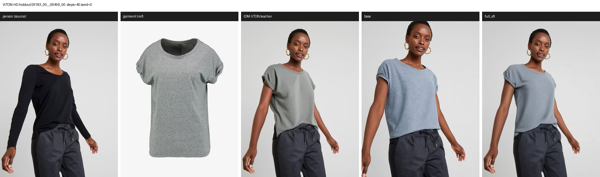
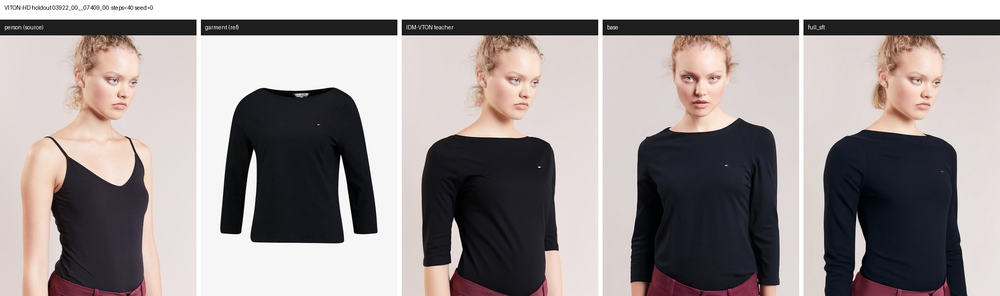
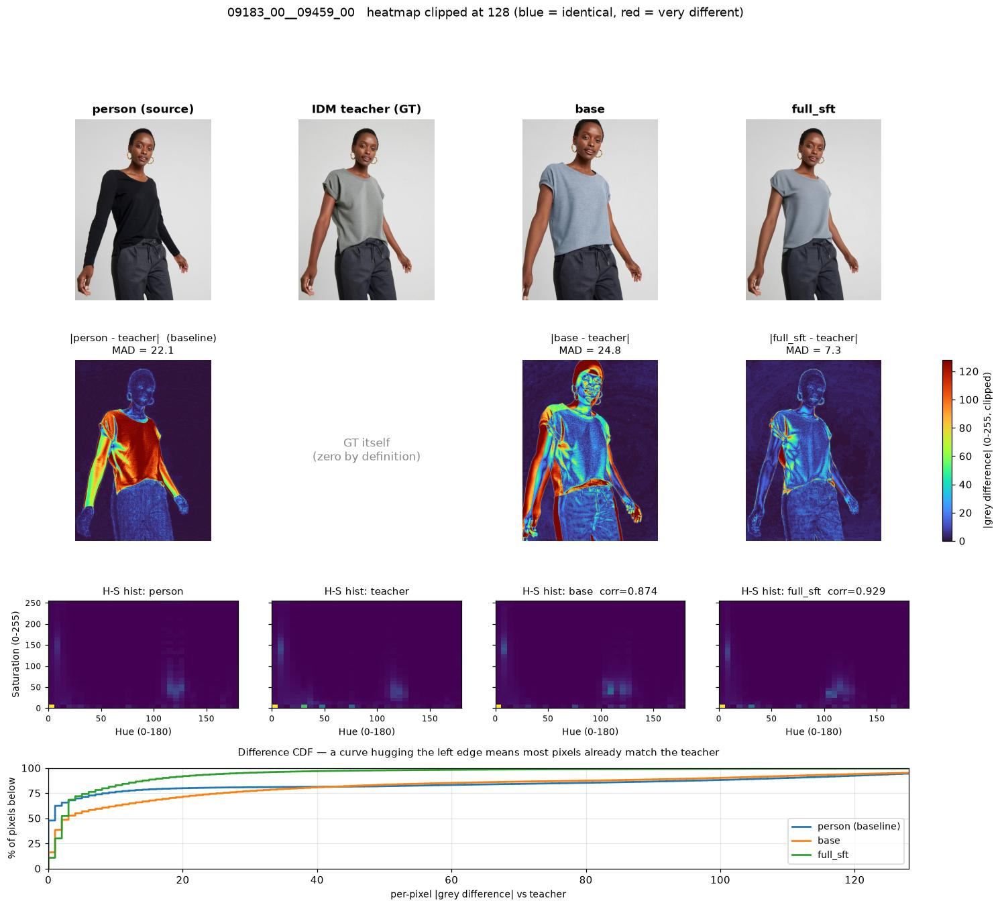

# 全参 SFT 评测结果（2026-08-15）

模型：[lee31221/Qwen-Image-Edit-Outfit-2511-SFT](https://huggingface.co/lee31221/Qwen-Image-Edit-Outfit-2511-SFT)
（训练记录见 [FULL_SFT_RUN_20260815.md](FULL_SFT_RUN_20260815.md)）

双轨评测，固定 `seed=0 / steps=40`：域内留出集看「有没有学到换装」，业务域看「能不能用」。

---

## 1. 域内：VITON-HD test 留出集（训练未见）

脚本 `scripts/eval_viton_holdout.py`，6 样本，768×1024，prompt 1592 字符（与训练同分布）。

| 模型 | MAD vs 人物图 | MAD vs teacher | hist corr vs teacher |
|---|---|---|---|
| *参照：teacher vs 人物图* | *18.64* | *0* | *1.0* |
| base | 35.65 | 28.94 | 0.8036 |
| **full_sft** | **20.04** | **9.31** | **0.9380** |

**怎么读这三行（关键）：**

`MAD(person, teacher) = 18.64` 是「一次正确换装本该产生的改动量」，作为标尺：

- **full_sft 改动量 20.04 ≈ 标尺 18.64** → 改得不多不少
- **full_sft 距 teacher 9.31 < 18.64** → 比原图更接近 teacher，**说明不是靠「少改动」刷低指标**
- **base 改动量 35.65 ≈ 标尺的 2 倍**（改太多），且**距 teacher 28.94 > 18.64** → 比什么都不做还远，即在改错的东西

6/6 样本的 `MAD vs teacher` 全部改善，且方差收紧（base 17.1–47.4，full_sft 7.3–11.9）。

**视觉确认：** base 会拉近镜头、改构图、人脸漂移、颜色偏；full_sft 保住取景/姿态/身份，
服装款式跟随参考图（船领、七分袖等细节能对上）。

拼图（`人物 | 服装 | IDM teacher | base | full_sft`）：





全部 6 组见 `outputs/viton_holdout_0815/*_compare.jpg`（`outputs/` 不入 git）。
VITON-HD 素材为 CC BY-NC，此处仅作研究用途展示，见 [NOTICE.md](../NOTICE.md)。

### 指标可视化

标量看不出差异**分布在哪**，用 `scripts/visualize_metrics.py` 展开：



三点值得注意：

1. 第 2 行第 1 格 `|person − teacher|` 是 18.64 基线的可视化——正确换装只该点亮上衣区域
2. `base` 的热力图连**人脸都在发亮**（身份被改），`full_sft` 大面积深蓝
3. 最下方 CDF 里 `base` 曲线**全程在 person 基线之下**：不只是均值差，而是在每个差异档位上都比原封不动更糟

指标定义、读法与陷阱见 [EVAL.md](EVAL.md#指标定义)。

---

## 2. 业务域：case02 真实关键帧 + GPT Image 2 参照

脚本 `scripts/run_case02_v2_prompt_eval.sh`，2 shot，720×1280，live v2 prompt（**2000 / 1922 字符**）。

| 模型 | MAD vs 源帧 shot00 | shot01 |
|---|---|---|
| GPT Image 2（生产参照） | 48.04 | 37.28 |
| Qwen base | 72.77 | 86.77 |
| IDM-LoRA | 42.13 | 81.94 |
| **full_sft** | **32.16** | **26.22** |

**定性差异（这里才是重点）：**

| 模型 | 表现 |
|---|---|
| GPT Image 2 | 只换服装，构图/姿态/背景/字幕全保留 —— 生产可用 |
| Qwen base | **整图重绘**：换成夜市/商场场景、换人，完全没在做局部编辑 |
| IDM-LoRA | 同样崩：shot00 变成拼贴（衣服悬浮、人头畸变），shot01 整场替换 |
| **full_sft** | **真正在做局部编辑**：走廊背景、姿态、鞋袜都保住，服装换成套装 |

full_sft 相对 base/LoRA 是**质变**（从「重绘整图」到「局部换装」），但**仍不及 GPT**，
可见缺陷：

1. **服装颜色错**：参考图是黑色/蓝色套装，输出成白色上衣
2. **字幕处理不过关**：shot00 直接丢掉底部字幕，shot01 重绘成乱码字形
3. 轻微身份漂移与背景简化

拼图：`outputs/case02_fullsft_0815/*_compare.jpg`

> **不入库**：case02 素材是业务视频帧且含真人肖像，故不随仓库分发，仅本地留档。

> 归档提示：`compose_idm_compare.py` 原先把第 4 栏标签写死为 `IDM-LoRA`，
> 现已改为 `--idm-label`（wrapper 用 `MODEL_B_LABEL` 传入），旧图注意标签可能不符。

---

## 3. 结论

**学会了任务，但被训练分布锁死。** 两轨结果放在一起解释力很强：

- 域内（同 prompt、同域）：全参 SFT 明显优于 base，**换装能力确实学到了**
- 业务域（新 prompt、新域）：从崩溃变成可用雏形，但颜色保真、字幕、身份一致性都不达标

对应的病因在 [DATA_SCALING_PLAN.md](DATA_SCALING_PLAN.md)：训练集只有 **1 条 prompt**（1592 字符）、
每人只配 1 件衣服、仅正面上装、无字幕监督。而线上 prompt 是 1.9k–2k 字符且要求处理字幕。

**下一步优先级**（详见 DATA_SCALING_PLAN 第 5 节）：

1. prompt 表层增广 —— 直接检验「指令单一」是否为主因，零新增图片
2. 真实帧 + GPT 作第二 teacher —— 补目标域，且能直接监督字幕与颜色保真
3. 扩 pair（k=3~5）、接 DressCode、多参考

---

## 4. 复现

```bash
# 域内留出集
python scripts/eval_viton_holdout.py \
  --model base=$MODEL_DIR \
  --model full_sft=/path/to/Qwen-Image-Edit-Outfit-2511-SFT \
  --out-dir $OUTPUT_ROOT/viton_holdout --n 6 --steps 40 --seed 0 --cpu-offload

# 业务域(需自备 TestSet 与已有 outfit_v2 run)
CPU_OFFLOAD=1 MAX_SAMPLES=2 MODEL_B_LABEL="full_sft (ZeRO-3)" \
  IDM_MODEL=/path/to/Qwen-Image-Edit-Outfit-2511-SFT \
  OUT_ROOT=$OUTPUT_ROOT/case02_fullsft \
  bash scripts/run_case02_v2_prompt_eval.sh
```

共享卡上务必 `--cpu-offload` / `CPU_OFFLOAD=1`：模型 bf16 权重约 57.7GB，
单张 80GB 卡在有其他租户时会 OOM（实测 GPU4 被占后即失败）。
