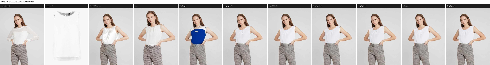
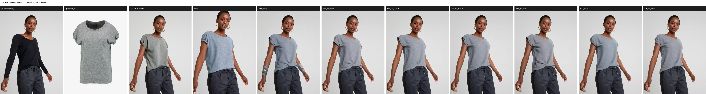
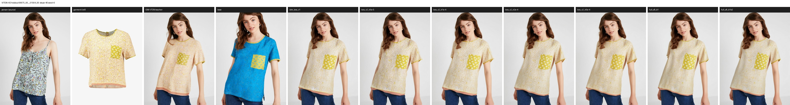
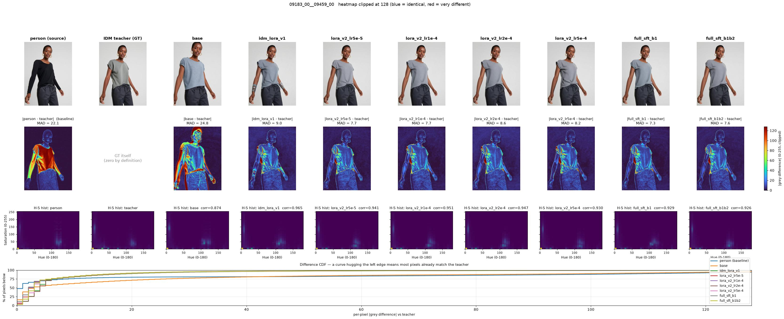

# 全参 SFT 评测结果（2026-08-15）

模型：[lee31221/Qwen-Image-Edit-Outfit-2511-SFT](https://huggingface.co/lee31221/Qwen-Image-Edit-Outfit-2511-SFT)
（训练记录见 [FULL_SFT_RUN_20260815.md](FULL_SFT_RUN_20260815.md)）

双轨评测，固定 `seed=0 / steps=40`：域内留出集看「有没有学到换装」，业务域看「能不能用」。

---

> **⚠️ 2026-08-17 更新：本页第 1.1 节的核心结论已被 200 样本复现推翻。**
> 6 样本时得出「域内 LoRA 与全参无法区分」（Δ=−0.09, t=−0.48）；
> 扩到 200 样本后**方向反转且显著**（Δ=+0.34, t=+3.45，全参更优）。
> 完整结果见 [第 1.4 节](#14-200-样本复现推翻了-6-样本的结论)，
> 下方 1.1–1.3 节的 6 样本数字保留作为对照记录，**引用结论请以 1.4 节为准**。

## 1. 域内：VITON-HD test 留出集（训练未见）

脚本 `scripts/eval_viton_holdout.py`，6 样本，768×1024，seed 0、40 步，
评测 prompt 统一为 **1592 字符的全文 v2**。

### 参评模型

| 名称 | 是什么 | 训练 prompt | 有效 batch → 步数 | 可训参数 |
|---|---|---|---|---|
| `base` | 未训练底座 | — | — | 0 |
| `idm_lora_v1` | **最初那版 LoRA** | **v1：2 条英文短指令，76–223 字符** | **4 → 约 2854** | 0.118B |
| `lora_v2_lr5e-5` | LoRA r16 | v2：1 条，1592 字符 | 8 → 1427 | 0.118B |
| `lora_v2_lr1e-4` | LoRA r16 | 同上 | 8 → 1427 | 0.118B |
| `lora_v2_lr2e-4` | LoRA r16 | 同上 | 8 → 1427 | 0.118B |
| `lora_v2_lr5e-4` | LoRA r16 | 同上 | 8 → 1427 | 0.118B |
| `full_sft_b1` | 全参 DiT SFT | 同上 | 8 → 1427 | 20.43B |
| `full_sft_b1b2` | 全参 DiT SFT，**数据翻倍**（b1+b2 22 829 条） | 同上 | 8 → **2854** | 20.43B |

**`idm_lora_v1` 与 v2 系列的关系**：合成图片与 IDM teacher 标签**完全相同**（同一批 11 415 条），
LoRA 配置也相同（r16、lr 1e-4、1 epoch、同 target modules、同 max_pixels / GC / wd）。
差异只有两处：**训练指令**（v1 短英文 vs v2 全文中文）与**卡数导致的有效 batch / 步数**。
由于评测统一用 1592 字符 v2 prompt，`idm_lora_v1` 是在**分布外**被评测的。

### 结果

| 模型 | MAD vs 人物图 | MAD vs teacher | hist corr vs teacher | 单样本 stdev |
|---|---|---|---|---|
| *参照：teacher vs 人物图* | *18.64* | *0* | *1.0* | — |
| base | 35.66 | 28.95 | 0.8717 | 10.90 |
| idm_lora_v1 | 22.18 | 12.46 | 0.9294 | **5.27** |
| lora_v2_lr5e-5 | 20.00 | 9.92 | 0.9350 | 1.87 |
| lora_v2_lr1e-4 | 19.63 | 9.23 | 0.9273 | 1.29 |
| lora_v2_lr2e-4 | 20.58 | 10.02 | 0.9464 | 1.33 |
| lora_v2_lr5e-4 | **19.20** | **8.94** | 0.9452 | **0.65** |
| **full_sft_b1** | 20.04 | 9.32 | **0.9433** | 1.52 |
| full_sft_b1b2 | 20.36 | 9.28 | 0.9162 | 1.42 |

> 指标一律从**落盘 JPEG** 计算。早期版本对新生成图用内存 PIL、对复用图用 JPEG，
> 而 JPEG 的 4:2:0 色度下采样只损伤色度、几乎不动亮度，导致 `hist corr` 两组不可比
> （灰度 MAD 仅差 0.01）。现已统一，故本表 hist 数值与首版略有出入。

**怎么读（关键）：**

`MAD(person, teacher) = 18.64` 是「一次正确换装本该产生的改动量」，作为标尺：

- **训练后的模型改动量 19.2–22.2 ≈ 标尺 18.64** → 改得不多不少
- **它们距 teacher 8.9–12.5 < 18.64** → 比原图更接近 teacher，**不是靠「少改动」刷低指标**
- **base 改动量 35.66 ≈ 标尺两倍**（改太多），且**距 teacher 28.95 > 18.64** → 比什么都不做还远，即在改错的东西

**视觉确认：** base 会拉近镜头、改构图、人脸漂移、颜色偏；v2 系列与 full_sft 都保住取景/姿态/身份，
服装款式跟随参考图，且**彼此肉眼难分**——与指标一致。

另一个常被忽略的信号是**单样本 stdev**：base 高达 10.90（时好时坏），
v2 系列收敛到 0.65–1.87。训练带来的一致性提升甚至比均值提升更明显。

### 1.1 LoRA 与全参是否有差别（配对检验）

八个模型跑的是**同一批样本**，所以应当用配对比较——按样本作差再看均值与标准误，
而不是比较两个独立均值（后者会把样本难度差异当成噪声，在 n=6 时几乎必然得不出结论）。

`scripts/paired_eval_stats.py`，指标 `mad_vs_teacher`，参照 `full_sft_b1`（负 = 更接近 teacher）：

| 对照 | Δ | sd | se | t | 判定（df=5，\|t\|>2.57 即 p<0.05） |
|---|---|---|---|---|---|
| idm_lora_v1 | +3.15 | **5.38** | 2.20 | +1.43 | 无法区分（**但方差极大，见下**） |
| lora_v2_lr5e-5 | +0.61 | 0.40 | 0.16 | +3.69 | 显著劣于全参 |
| lora_v2_lr1e-4 | **−0.09** | 0.46 | 0.19 | −0.48 | **与全参无法区分** |
| lora_v2_lr2e-4 | +0.70 | 0.41 | 0.17 | +4.13 | 显著劣于全参 |
| lora_v2_lr5e-4 | −0.38 | 1.58 | 0.64 | −0.59 | 无法区分（样本间波动大） |
| **full_sft_b1b2** | **+0.03** | 0.51 | 0.21 | **+0.16** | **与 b1 无法区分（数据翻倍无增益）** |

#### idm_lora_v1 的「无法区分」是假象——它是偶发崩溃

逐样本看就清楚了（`mad_vs_teacher`）：

| 样本 | base | idm_lora_v1 | lora_v2_lr1e-4 | full_sft |
|---|---|---|---|---|
| 09183 | 24.77 | 9.02 | 7.68 | 7.31 |
| **07546** | 17.07 | **22.85** | 8.86 | 8.76 |
| 08839 | 25.47 | 10.17 | 9.67 | 9.29 |
| 02299 | 23.04 | 9.61 | 8.57 | 8.81 |
| 06675 | 47.38 | 10.11 | 9.09 | 9.84 |
| 03922 | 35.96 | 13.02 | 11.49 | 11.90 |

`idm_lora_v1` 在 5 个样本上是 9–13（尚可），唯独 `07546` 飙到 **22.85**。
配对 t 检验之所以判「无法区分」，正是被这个离群值撑大的方差（sd 5.38，其余模型约 0.4）稀释了。
**均值差（+3.15）是真实的，只是它来自一次崩溃而非全面退化。**



栏位：`人物 | 服装 | IDM teacher | base | idm_lora_v1 | lora_v2_lr5e-5 | lr1e-4 | lr2e-4 | lr5e-4 | full_sft_b1 | full_sft_b1b2`。
参考服装是白色无袖上衣，只有 `idm_lora_v1` 输出成蓝色配白斜襟。

**这才是 v1→v2 换 prompt 的真正收益**：它主要不是提升平均质量（9–13 → 9–11 有限），
而是**消除了偶发崩溃**——单样本 stdev 从 5.27 降到 1.29。
指令分布不匹配的表现不是「一直差一点」，而是「大多数时候能用、偶尔完全失控」，
这在生产里比平均分低更危险。case02 上的整幕重绘是同一失效模式的极端版本。

**结论：在这条域内留出集上，r16 LoRA（0.118B 可训、1h49m）与全参 SFT（20.43B、2h22m）
打平。** 全参多训的 173 倍参数没有换来可测量的优势。

这不代表全参没用，而是说明**当前瓶颈在数据而非容量**：训练集只有 1 条 prompt、
仅正面上装、每人 1 件衣服（见 [DATA_SCALING_PLAN.md](DATA_SCALING_PLAN.md)），
这个难度用低秩增量就足以拟合。要检验容量差异，得先把数据的多样性提上去。

工程含义很直接：同等效果下 LoRA 省 23% 时间、省掉 ZeRO-3 的复杂度，
产物是 226MB 适配器而非 40.86GB 全量权重。

拼图（`人物 | 服装 | IDM teacher | base | 各训练变体`）：



栏位统一为：`人物 | 服装 | IDM teacher | base | idm_lora_v1 | lora_v2_lr5e-5 | lr1e-4 | lr2e-4 | lr5e-4 | full_sft_b1 | full_sft_b1b2`。

下面这个样本最能说明差距——参考服装是米色碎花配黄色圆点口袋，
**base 直接画成蓝色衬衫**（它在该样本上 MAD 高达 47.4），五个训练后的变体则全部还原正确：



### 指标可视化（七方）



第二行热力图是关键：最左 `|person − teacher| MAD=22.1` 是「正确换装该动哪些像素」的基线，
红色只集中在上衣。对比之下 **base 整图发亮、连人脸都在变**，
而训练后的各变体都是大片深蓝、只剩轮廓细线，**彼此肉眼不可分**。
最下方 CDF 里 base 单独垂在下方，其余挤成一束——这就是配对检验「无法区分」的视觉版本。

另外两点值得注意：

- 第 2 行第 1 格 `|person − teacher|` 就是 18.64 基线的可视化——正确换装只该点亮上衣区域
- CDF 里 `base` 曲线**全程在 person 基线之下**：不只是均值差，而是在每个差异档位上都比原封不动更糟

全部 6 组拼图与可视化见 `outputs/qwen_kf_zeroshot/holdout_3way_0816/`（`outputs/` 不入 git）。
VITON-HD 素材为 CC BY-NC，此处仅作研究用途展示，见 [NOTICE.md](../NOTICE.md)。
指标定义、读法与陷阱见 [EVAL.md](EVAL.md#指标定义)。

---

### 1.1.1 数据翻倍没有带来可测量的提升（阴性结果）

`full_sft_b1b2` 用 b1+b2 合并的 **22 829 条**从 base 重训（2854 步、4h41m，
见 [FULL_SFT_B1B2_RUN_20260816.md](FULL_SFT_B1B2_RUN_20260816.md)），
与 `full_sft_b1` 的唯一变量就是**数据量翻倍**。

三个指标全部做配对检验，参照 `full_sft_b1`：

| 指标 | Δ | sd | se | t | 判定 |
|---|---|---|---|---|---|
| `mad_vs_teacher` | +0.03 | 0.51 | 0.21 | +0.16 | 无法区分 |
| `hist_vs_teacher` | −0.03 | 0.08 | 0.03 | −0.80 | 无法区分 |
| `mad_vs_person` | +0.31 | 0.83 | 0.34 | +0.93 | 无法区分 |

**结论：配对数量翻倍，域内质量毫无变化。** 均值表上 hist 从 0.9433 掉到 0.9162 看着像退步，
但配对后 sd 达 0.08，同样落在噪声内——不能解读为「数据多了反而更差」。

**为什么这是符合预期的、也是有价值的：** b2 补的是**配对多样性**（同一批人物×服装重新搭配），
不是**实体多样性**——人物图和服装图仍是那 11 647 张，prompt 仍是唯一那条 1592 字符模板，
仍只有正面上装、仍无字幕监督。而 [DATA_SCALING_PLAN.md](DATA_SCALING_PLAN.md) 第 2 节
诊断出的瓶颈正是这些维度的坍缩。

所以这个阴性结果**反过来验证了诊断**：在多样性不变的前提下，
把同一批素材重新排列组合、数量翻倍，收益为零。花 4h41m 的算力买到的信息量是
「此路不通」——这比得到一个小幅提升更有决策价值，
因为它把资源明确指向了 P0（多参考）与真实域数据。

> 记账：`DATA_SCALING_PLAN` 曾预测扩 pair 能「提升域内保真度上限」。
> 本实验证伪了 k=2 这一档。k=3~5 是否会出现拐点未知，但先验已明显变差。

---

## 1.2 LoRA 学习率扫描（单独对比）

四个 LR 点，其余全部对齐（同 11 415 条 v2 数据、r16、1 427 步、有效 batch 8、ConstantLR、bf16）。

| LR | MAD vs teacher | 单样本 stdev | 配对 vs full_sft | 训练 loss 窗口均值变化 |
|---|---|---|---|---|
| 5e-5 | 9.92 | 1.87 | 显著劣（t=+3.69） | −18.2%（降幅最大、最平稳） |
| **lora_v2_lr1e-4** | **9.23** | 1.29 | 无法区分 | −1.9% |
| lora_v2_lr2e-4 | 10.02 | 1.33 | 显著劣（t=+4.13） | **+5.5%（不降反升）** |
| **lora_v2_lr5e-4** | **8.94** | **0.65** | 无法区分 | −15.4%（但噪声最大，max 0.217） |

### 关键发现：训练 loss 没能预测评测排名

上游的扫描报告依据 train loss 得出「5e-5 最干净、1e-4–5e-5 是稳定带、更高会失稳」。
**评测结果与之相左**：

- **5e-5 的 loss 降幅最大（−18.2%），评测却显著劣于全参**
- **5e-4 的 loss 曲线最不稳（尖峰到 0.217），评测反而最好**（均值 8.94、stdev 0.65 都是最低）
- 评测上的响应同样**非单调**：5e-4 好、1e-4 好、5e-5 与 2e-4 差，中间凹陷

这正是 [FULL_SFT_RUN](FULL_SFT_RUN_20260815.md) 第 7 节那个警告的实证：
扩散训练每步随机 timestep 与噪声，**train loss 是噪声主导的量**，
不同 LR 之间比较它的绝对值或降幅都没有意义。**选 LR 必须看留出集评测。**

### 需要注意的边界

- n=6，`5e-4` 虽然均值最好，但它与 full_sft 的配对差异 sd 高达 1.58（其余约 0.4），
  说明它在不同样本上表现摇摆——单个样本 `03922` 上它 8.72、full_sft 11.90，差距主要来自这一条。
  **不能据此宣称 5e-4 最优**，只能说它与全参无法区分。
- 全部结论都基于 VITON 域内、单一 prompt。业务域的排名可能完全不同，见下一节。

> 上游 `lora_lr_sweep/README.md` 的 Δ 列（−89.9% / +147.8% / +76.3% / −6.9%）与
> 同页 first100/last100 数值对不上（按那两列算应为 −1.9% / +5.5% / −15.4% / −18.2%），
> 正文引用的反而是后者。本表采用与 first100/last100 自洽的算法。

---

## 1.4 200 样本复现：推翻了 6 样本的结论

`scripts/eval_viton_holdout.py --n 200`，同 seed=0 / 40 步，同一批 VITON-HD test 留出集。
因取样是「固定 seed 打乱后取前 n 条」，原来那 6 条是这 200 条的子集，图片直接复用。
只跑承载结论的 4 个模型（14 小时 / GPU5 整卡）。

| 模型 | MAD vs 人物图 | MAD vs teacher | hist corr |
|---|---|---|---|
| base | 40.14 | 38.95 | 0.8526 |
| lora_v2_lr1e-4 | 21.58 | 9.10 | **0.9334** |
| **full_sft_b1** | **21.40** | **8.76** | 0.9233 |
| full_sft_b1b2 | 21.59 | 8.92 | 0.9118 |

配对检验（参照 `full_sft_b1`，df=199，|t|>1.97 即 p<0.05）：

| 对照 | 指标 | Δ | se | t | 判定 |
|---|---|---|---|---|---|
| lora_v2_lr1e-4 | MAD vs teacher | +0.339 | 0.098 | **+3.45** | **显著劣于全参** |
| lora_v2_lr1e-4 | hist corr | +0.010 | 0.004 | **+2.78** | **显著优于全参** |
| lora_v2_lr1e-4 | MAD vs person | +0.186 | 0.129 | +1.43 | 无法区分 |
| full_sft_b1b2 | MAD vs teacher | +0.153 | 0.085 | +1.79 | 边缘 |
| full_sft_b1b2 | hist corr | −0.012 | 0.003 | **−3.56** | **显著劣于 b1** |
| full_sft_b1b2 | MAD vs person | +0.193 | 0.113 | +1.70 | 边缘 |

### 三条结论修订

**1. 「LoRA 与全参打平」不成立。** 6 样本 Δ=−0.09/t=−0.48 → 200 样本 Δ=+0.34/t=+3.45，
方向反转且显著。原先那 6 条恰好偏向 LoRA。**小样本给出的不是「差异不存在」，
只是「分辨不出」**——这两件事被混为一谈是本项目最值得记的教训。

**2. 但不是简单的「全参更好」，两个指标结论相反。**
全参在结构相似度（MAD）上显著更优，LoRA 在色彩分布（hist corr）上显著更优。
报单一指标会得出片面结论。

**3. 效应量很小，工程结论未变。**
base 38.95 → 全参 8.76，提升 30.19；LoRA 到 9.10，提升 29.85——
**LoRA 拿到了全参 98.9% 的收益**，代价是 0.118B vs 20.43B 可训参数、1h49m vs 2h22m。
统计上可区分，工程选型上仍然可以选 LoRA。**「统计显著」不等于「值得为它付出代价」。**

### 另一个警示：base 在小样本上被严重低估

`base` 的 MAD vs teacher 在 6 样本上是 28.95，200 样本上是 **38.95**。
原来那 6 条对未训练底座明显偏易，导致「训练带来的提升」被低估了三分之一。
所有跨样本量引用的数字都必须标注 n。

### b1b2 依旧没有增益

数据翻倍在 MAD 上边缘（t=1.79）、在 hist 上**显著更差**（t=−3.56）。
200 样本没有改变「配对数量翻倍无收益」这一结论，反而更清晰——
详见 [1.1.1 节](#111-数据翻倍没有带来可测量的提升阴性结果) 的成因分析。

---

## 2. 业务域：case02 真实关键帧 + GPT Image 2 参照

脚本 `scripts/run_case02_v2_prompt_eval.sh`，2 shot，720×1280，live v2 prompt（**2000 / 1922 字符**）。

| 模型 | 商品参考图 | MAD vs 源帧 shot00 | shot01 | 定性 |
|---|---|---|---|---|
| GPT Image 2（生产参照） | 3 | 48.04 | 37.28 | 正确局部换装 |
| Qwen base | 3 | 72.77 | 86.77 | **整幕重绘** |
| idm_lora_v1 | 3 | 42.13 | 81.94 | **整幕重绘** |
| lora_v2_lr1e-4 | 3 | 44.59 | 82.02 | **整幕重绘** |
| full_sft | 3 | 32.16 | 26.22 | 局部编辑 |
| Qwen base | **1** | 32.49 | 55.46 | **局部编辑** |
| **full_sft** | **1** | **21.21** | **23.24** | 局部编辑，最干净 |

### 2.1 崩溃的主因是参考图数量，不是 prompt 长度

原先把 case02 的整幕重绘归因于「prompt 太长、分布不匹配」。**这个诊断不完整。**

同一个 base 模型、同一套 v2 模板，**只把商品参考图从 3 张降到 1 张**：

- shot00：72.77 → **32.49**
- shot01：86.77 → **55.46**
- 定性上从「生成一个全新的夜市场景」变成「保住走廊、姿态、鞋子甚至字幕的局部换装」

prompt 只从 2000 缩到 1910 字符（少了商品描述段），90 个字符解释不了这种量级的行为翻转。
真正变的是**输入图数量：4 张（源帧+3 商品）→ 2 张（源帧+1 商品）**，
而 2 张正是训练时的配置（`n_product_refs=1`）。

**结论：多参考图输入把模型推出了分布，触发「重新生成整图」而非「编辑」。**
这也解释了之前观察到的颜色错误——模型面对 3 张不同视角的商品图时不知道该融合还是该选一张。

### 2.2 业务域上 LoRA 不等于全参（与域内相反）

在 3 张参考图这个更难的设定下：

| | 表现 |
|---|---|
| `base` / `idm_lora_v1` / `lora_v2_lr1e-4` | 全部整幕重绘 |
| `full_sft` | 唯一还能做局部编辑的 |

**域内留出集上 LoRA 与全参打平，业务域上却分道扬镳。** 合理的解释是：
低秩增量足以拟合训练分布（单一 prompt、2 图输入、VITON 域），
但**分布外的鲁棒性需要更大的容量**——全参更新了全部 20.43B 参数，
LoRA 只在 13 个线性层上加了 r16 的增量。

这条修正了第 1.1 节的结论边界：**「LoRA 与全参打平」只在域内成立**，
选型时若目标是真实业务帧，不能只看域内数字。

**与 GPT 的剩余差距（1 张参考图这个最佳设定下）：**

1. **服装颜色仍错**：参考是黑色/蓝色套装，输出白色上衣
2. **只换上衣、不换下装**：产品是套装，GPT 上下都替换，full_sft 保留了原短裤——
   这也是它 MAD（23.24）低于 GPT（37.28）的部分原因，属于**欠编辑**而非更好
3. **字幕不更新**：原字幕被完整保留，但没有换成新的营销文案（GPT 会重绘）

> 第 2 点是「MAD 低不等于更好」的活例子：没有 GT 时这个指标只能说明改动量，
> 判好坏必须看图。见 [EVAL.md](EVAL.md#怎么读这些数字)。

所有配置合并成一张对照条（每 shot 一张）：

```bash
python scripts/compose_case02_matrix.py \
  --run-root $OUTPUT_ROOT/qwen_kf_zeroshot \
  --out-dir  $OUTPUT_ROOT/qwen_kf_zeroshot/case02_matrix
```

栏位：`源帧 | GPT(3refs) | base(3) | idm_lora_v1(3) | lora_v2_lr1e-4(3) | full_sft(3) | base(1) | full_sft(1)`，
每格标注 MAD vs 源帧。

### 2.3 一个待确认的观察：case02 上的白色偏置

`full_sft` 在两个 shot 都输出**白色上衣**，而参考商品分别是黑色与蓝色套装；
`base @ 1ref` 在 shot01 反而给出了与 GPT 一致的蓝色。

但同一个 `full_sft` 在 VITON 留出集上颜色是准的（灰 T、黑船领、米色碎花都对上），
所以**不是全局白色偏置**。更可能的原因是 case02 的商品图形态（模特实拍 / 多件套 / 复杂背景）
与 VITON 的纯白平铺单件差异过大。样本只有 2 个，暂列为观察，需更多 case 才能定论。

> **不入库**：case02 素材是业务视频帧且含真人肖像，故不随仓库分发，仅本地留档。

> 归档提示：`compose_idm_compare.py` 原先把第 4 栏标签写死为 `IDM-LoRA`，
> 现已改为 `--idm-label`（wrapper 用 `MODEL_B_LABEL` 传入），旧图注意标签可能不符。

---

## 3. 对比的有效边界（重要）

**`full_sft` vs `base` 是干净的对比**：同一份评测素材、同一条 prompt、同 seed 同步数，
base 未经任何训练。结论「全参 SFT 在域内和业务域都优于底座」成立。

**`full_sft` vs `IDM-LoRA` 是混淆的对比，不能得出「全参优于 LoRA」。** 两者训练时至少有三处不同：

| | IDM-LoRA | full_sft |
|---|---|---|
| metadata | `converted_idm_synth_train/`（v1） | `converted_idm_synth_train_v2/` |
| **prompt 长度** | **76–223 字符** | **1592 字符** |
| **prompt 种类** | **2 条英文短指令** | 1 条中文全文模板 |
| 学习率 | 1e-4 | 1e-5 |
| 可训参数 | DiT LoRA r16（约 0.118B） | 全部 DiT（20.43B） |
| 训练图片 | 11415（同一批） | 11415（同一批） |

图片是同一批，但**指令分布完全不同**。而评测统一用 live v2 prompt（留出集 1592 字符、
case02 2000/1922 字符），也就是说：

- `full_sft` 的评测指令**落在其训练分布内**
- `IDM-LoRA` 的评测指令**远在其训练分布之外**（训练见的是 76–223 字符英文短句）

所以 LoRA 的崩溃主要说明**指令分布不匹配**的破坏力，这本来也正是它被用来论证的观点
（见 [KNOWLEDGE.md](KNOWLEDGE.md)）。同一个数据点不能既用来证明「prompt 不匹配会崩」，
又用来证明「LoRA 容量不如全参」。

**该对照已于 2026-08-16 补齐**（见第 1.1 节）：用同一份 v2 数据、同为 1427 步重训了
r16 LoRA，结论是**与全参在域内留出集上无法区分**。因此本节的警告只适用于
本页第 2 节 case02 表里那一行旧的 `IDM-LoRA`（v1 短指令训练），
以及任何引用它来比较训练方式的说法。

**业务域的对照仍缺失**：case02 表里还没有 v2 LoRA 这一列，所以「在真实关键帧上
LoRA 与全参谁更好」目前无法回答。

## 4. 结论

**学会了任务；域内容量够用，域外不够；而最大的单点问题是输入图数量。** 四条结果：

- **域内**：训练后的模型全部远优于 base（MAD vs teacher 28.95 → 8.9~10.0），换装能力确实学到了
- **域内容量**（200 样本修订）：全参在结构相似度上**显著优于** r16 LoRA（Δ=0.34, t=3.45），
  但 LoRA 在色彩分布上**显著更优**（t=2.78）；且 LoRA 拿到全参 **98.9%** 的收益，
  统计显著但工程上不足以否定 LoRA 选型
- **数据数量**：配对数量翻倍（11 415 → 22 829）无增益，200 样本下 MAD 边缘、hist 显著更差
- **域外容量**：3 张参考图下，**只有全参不崩**，LoRA（v1/v2 都是）与 base 一样整幕重绘
  → 「LoRA 打平全参」**只在域内成立**
- **输入图数量是最大杠杆**：参考图 3→1，连未训练的 base 都从整幕重绘变成局部编辑
  （72.77→32.49），因为训练时固定就是「源帧 + 1 张商品图」

对应的病因在 [DATA_SCALING_PLAN.md](DATA_SCALING_PLAN.md)：训练集只有 **1 条 prompt**（1592 字符）、
每人只配 1 件衣服、仅正面上装、无字幕监督。而线上 prompt 是 1.9k–2k 字符且要求处理字幕。
数据这么单一，低秩增量就够拟合——这解释了为什么多训 173 倍参数换不来可测量的收益。

**下一步优先级**（详见 DATA_SCALING_PLAN 第 5 节）：

1. **多参考训练数据**（`n_product_refs` 2–3）—— 已被证明是业务域最大的单点故障，
   优先级从原来的 P3 提到 **P0**
2. 真实帧 + GPT 作第二 teacher —— 补目标域，并直接监督字幕与颜色保真
3. prompt 表层增广 —— 仍值得做，但已知它不是 case02 崩溃的主因
4. 扩 pair（batch2 已完成，共 23 294 条）、接 DressCode

> 简历/汇报口径：
> - 可主张「全参 SFT 显著优于底座；域内 r16 LoRA 以 0.118B 可训参数拿到全参 98.9% 的收益，
>   但业务域只有全参不崩」——两句要一起说。
> - 可主张「6 样本得出的『无差异』在 200 样本下被推翻，据此建立了最小样本量与配对检验的评测规范」
>   ——这是方法论层面的加分项，主动讲比被问出来好。
> - 可主张「定位出业务域失效的主因是输入参考图数量与训练不一致，
>   通过对照实验（同模型、同 prompt、仅改参考图数）验证」。
> - 可主张「用对照实验证伪了『堆配对数量能提升质量』：数据翻倍后三项指标均无显著变化，
>   据此把资源从扩量转向补多样性」——阴性结果讲清楚比含糊的正向结论更可信。
> - **不可**主张某个 LR 最优——`5e-4` 均值最好但样本间波动大，与全参仍无法区分。
> - **不可**说 b1b2 更差——hist 均值下降不显著（sd 0.08）。

---

## 5. 复现

```bash
# 域内留出集：--model 吃完整模型目录，--lora 吃适配器(在底座上就地融合,免去 54GB 落盘)
python scripts/eval_viton_holdout.py \
  --model base=$MODEL_DIR \
  --model lora_v2=/path/to/lora_v2 \
  --model full_sft=/path/to/Qwen-Image-Edit-Outfit-2511-SFT \
  --lora lora_lr5e-5=/path/to/lr5e-5/epoch-0.safetensors \
  --lora lora_lr2e-4=/path/to/lr2e-4/epoch-0.safetensors \
  --lora lora_lr5e-4=/path/to/lr5e-4/epoch-0.safetensors \
  --lora-base $MODEL_DIR \
  --out-dir $OUTPUT_ROOT/viton_holdout --n 6 --steps 40 --seed 0 --cpu-offload

# 差异是真是噪声(同一批样本 -> 必须配对比较)
python scripts/paired_eval_stats.py \
  --metrics $OUTPUT_ROOT/viton_holdout/metrics.json --reference full_sft

# 业务域(需自备 TestSet 与已有 outfit_v2 run)
CPU_OFFLOAD=1 MAX_SAMPLES=2 MODEL_B_LABEL="full_sft (ZeRO-3)" \
  IDM_MODEL=/path/to/Qwen-Image-Edit-Outfit-2511-SFT \
  OUT_ROOT=$OUTPUT_ROOT/case02_fullsft \
  bash scripts/run_case02_v2_prompt_eval.sh
```

共享卡上务必 `--cpu-offload` / `CPU_OFFLOAD=1`：模型 bf16 权重约 57.7GB，
单张 80GB 卡在有其他租户时会 OOM（实测 GPU4 被占后即失败）。
